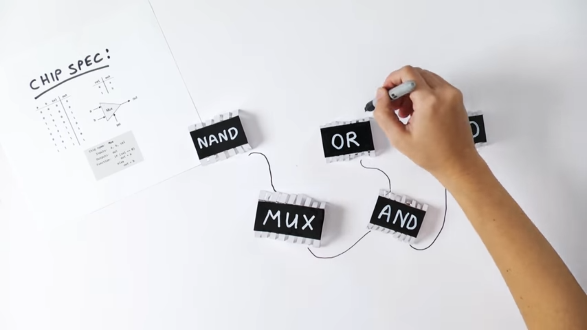
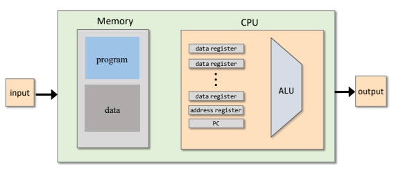
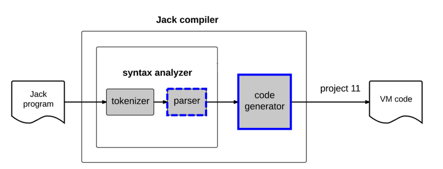

# nand2tetris
Building a modern computer (HACK) from a basic NAND gate

# Project 1: Boolean logic

• Logic gates\
• HDL\
• Hardware Simulation\
• Multi-bit buses

# Project 2: Boolean arithmetic

Building an ALU to perform boolean arithmetic

# Project 3: Memory

Build registers and encapsulate them in a RAM.

# Project 4: Machine language

HACK machine language specification

Practical: 

- Full adder
- Half adder
- ALU

# Project 5: Computer architecture

# Project 6: Assembler

development of the assembler: translation of machine code to binary code.

# Project 7: Virtual machine I
- VM abstraction: the stack, memory segments
- VM implementation: the stack, memory segments
- VM implementation platforms: VM emulator,VM translator
- VM translator: Building proposed implementation

# Project 8: Virtual machine II

- Branching: Abstraction, Implementation
- Functions: Abstraction and Implementation
- Implementing function call-and-return
- Implementation of the Virtual Machine on the HACK

# Project 9: High-level programming language (JACK): Overview

Specifications and application development of the JACK language. The JACK language is a high level programming language developed specifically for this course. It is very similar to JAVA language.

# Project 10: Compiler I: Parsing

Tokenizing, Grammar, Parse tree are the different steps taken to parse a JACK program.

# Project 11: Compiler II: Code Generation

Extending the basic syntax analyzer and adding code generation feature to automatically correct petty bugs.

# Project 12: Operating System (JACK OS)

The Operating System is written in the created language "Jack". 

It includes: Running-time analysis, Resource Allocation, Input Handling, Output Handling (graphics and texts), type conversions and string processing.

Coursera course by Noam Nisan and Shimon Schocken.
